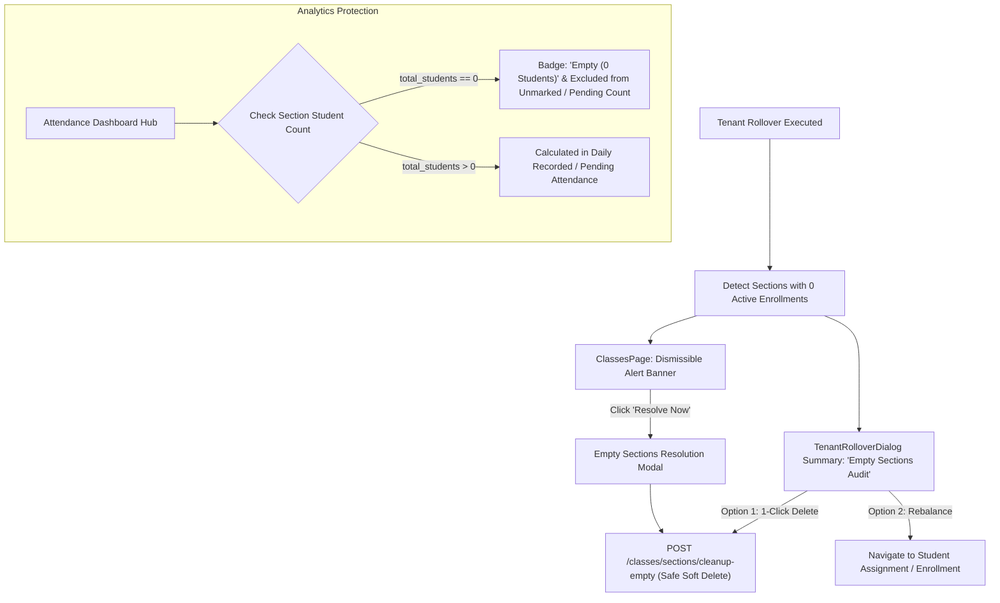

# Design Spec: Empty Sections Lifecycle Management & Attendance Analytics Protection

- **Author**: Antigravity Assistant & Pair Programmer
- **Date**: 2026-10-07
- **Status**: DRAFT (Submitted for Review)
- **Scope**: Backend Academic Service, Section Deletion Engine, Attendance Analytics, and Frontend Admin UX (Rollover, Classes Page, Attendance Hub)

---

## 1. Overview & Problem Statement

### 1.1 The Problem
When a school advances into a new academic session via Academic Year Rollover (`tenant_rollover`), students are promoted to the next grade. In scenarios where a class previously had multiple sections (e.g., Grade 9 Section A, Section B, Section C) but the incoming cohort is smaller or all students are initially assigned to Section A:
1. **Sections B and C remain in the database with 0 active enrolled students** for the new academic year.
2. **Attendance Analytics Distortion**: The daily attendance tracking engine and dashboard (`AttendanceDashboardHub.tsx`) count all active tenant sections. Because empty sections have 0 students, teachers cannot mark attendance (`BadRequestException: "No students found in this section to mark attendance for"`). As a result, empty sections remain permanently **"Unmarked"**, skewing daily school attendance compliance (e.g., showing 6/10 sections marked even when 100% of actual classes are completed).
3. **20-Student Rule Deadlock**: The backend strictly enforces `AcademicService.check_next_section_eligibility`, requiring the previous section to have at least 20 active students before a new section can be created. If an empty section (0 students) lingers, the school is blocked from adding sections in the future until that section is resolved.

### 1.2 Core Principle & Solution
Keeping empty sections unmonitored is bad practice. Admin and Office Admin must be **proactively prompted** upon rollover and in daily operations to either:
- **Fill (rebalance/assign students into)** the empty section, OR
- **Safely delete** the empty section.

Furthermore, attendance analytics must be guarded so that empty sections do not falsely depress attendance metrics while the school is in session.

---

## 2. Architecture & Data Flow



---

## 3. Backend Specification (`E:\SSUP\backend`)

### 3.1 Empty Section Definition & Query
A section is defined as **Empty** in academic year $Y$ if:
1. `Section.deleted_at IS NULL`
2. No active enrollment exists in year $Y$:
   ```sql
   SELECT COUNT(id) FROM student_enrollments
   WHERE section_id = :sec_id 
     AND academic_year_id = :year_id 
     AND status = 'ACTIVE' 
     AND deleted_at IS NULL
   ```
   equals 0.
3. No active student currently references this section:
   ```sql
   SELECT COUNT(id) FROM students
   WHERE section_id = :sec_id 
     AND status = 'ACTIVE' 
     AND deleted_at IS NULL
   ```
   equals 0.

### 3.2 Enhanced Validation in `_validate_section_deletion`
In `src/modules/academic/service.py`:
- Currently: checks `select(func.count(Student.id)).where(Student.section_id == section.id, Student.deleted_at == None)`.
- **Refinement**: Update to filter `Student.status == StudentStatus.ACTIVE.value`. Past graduated/transferred students whose historical foreign keys point to this section must NOT block soft deletion.
- Section 'A' constraint: Section 'A' cannot be deleted (`BadRequestException: "Section 'A' is the default section and cannot be deleted. Please enroll students into it."`).
- LIFO reverse order: Sections must be deleted from highest to lowest (e.g. C before B).

### 3.3 New Endpoints (`src/modules/academic/routers/sections.py`)

#### A. `GET /classes/empty-sections`
- **Query Params**: `academic_year_id: Optional[str] = None` (defaults to active academic year).
- **Permissions**: `ADMIN`, `OFFICE_ADMIN`.
- **Response**: `ApiResponse[List[EmptySectionResponse]]`:
  ```json
  [
    {
      "section_id": "sec-uuid-c",
      "section_name": "C",
      "class_id": "cls-uuid-10",
      "class_name": "Grade 10",
      "student_count": 0,
      "can_delete": true,
      "reason_if_cannot_delete": null
    },
    {
      "section_id": "sec-uuid-a",
      "section_name": "A",
      "class_id": "cls-uuid-1",
      "class_name": "Grade 1",
      "student_count": 0,
      "can_delete": false,
      "reason_if_cannot_delete": "Section 'A' is the default section and cannot be deleted. Please assign students to it."
    }
  ]
  ```

#### B. `POST /classes/sections/cleanup-empty`
- **Request Body**:
  ```json
  {
    "section_ids": ["sec-uuid-c", "sec-uuid-b"] // Optional: if omitted or empty, cleans up ALL deletable empty sections
  }
  ```
- **Execution Logic**:
  1. Identifies targeted sections and validates that each has 0 active enrollments in the current academic year.
  2. Filters out non-deletable sections (e.g., section 'A').
  3. Sorts sections within each class in reverse alphabetical/index order (LIFO: C, then B).
  4. Soft-deletes each section (`deleted_at = datetime.now(timezone.utc)`).
  5. Records audit logs for each deleted section (`AuditAction.SECTION_SOFT_DELETED`).
- **Response**: `ApiResponse[EmptySectionCleanupResult]`:
  ```json
  {
    "deleted_count": 2,
    "deleted_sections": [
      { "section_id": "sec-uuid-c", "class_name": "Grade 10", "section_name": "C" },
      { "section_id": "sec-uuid-b", "class_name": "Grade 10", "section_name": "B" }
    ],
    "skipped_sections": [
      { "section_id": "sec-uuid-a", "class_name": "Grade 1", "section_name": "A", "reason": "Default Section 'A' cannot be deleted" }
    ]
  }
  ```

### 3.4 Rollover Response Update (`TenantRolloverSummaryResponse`)
- Add fields:
  ```python
  empty_sections_count: int = 0
  empty_sections: List[EmptySectionSummaryItem] = Field(default_factory=list)
  ```
- Computed automatically during `tenant_rollover` after student promotion completes, giving the frontend immediate awareness.

### 3.5 Attendance Service Double-Protection (`src/modules/attendance/service.py`)
- In `get_dashboard_summary`:
  - When aggregating pending/unmarked sections, ensure that only sections with at least 1 active student are evaluated.
  - An empty section with 0 students does not count towards total pending sections.

---

## 4. Frontend Specification (`E:\SSUP\frontend`)

### 4.1 Rollover Dialog Audit Step (`TenantRolloverDialog.tsx`)
- When the rollover mutation succeeds and transitions to the summary screen:
  - If `summary.empty_sections_count > 0`:
    - Display an amber alert card:
      > ⚠️ **Empty Sections Detected ({summary.empty_sections_count})**
      > *Some sections have 0 students enrolled for the new session. Empty sections distort daily attendance metrics and block adding new sections (minimum 20 students rule).*
    - Provide a quick table of empty sections.
    - Offer actions:
      - `[Delete All Empty Sections]` (Triggers `cleanup-empty` mutation with confirmation dialog).
      - `[Review in Class Management]` (Closes dialog and redirects to `/academic/classes`).

### 4.2 Class Management Alert Banner & Modal (`ClassesPage.tsx`)
- At the top of `ClassesPage`:
  - Check if any loaded class contains sections with `student_count === 0`.
  - If detected, render a contextual warning alert:
    - **Header**: `⚠️ Empty Sections Detected`
    - **Body**: `Found {count} section(s) with 0 enrolled students for this academic session. To maintain accurate attendance analytics and section creation rules, please fill or delete them.`
    - **Button**: `[Manage Empty Sections]` (Opens `EmptySectionsCleanupModal`).
- **`EmptySectionsCleanupModal`**:
  - Displays all empty sections grouped by class.
  - Highlights Section 'A' with an informational notice: *"Section 'A' is required for every class and cannot be deleted. Assign students to this section."*
  - Shows `[Delete]` button next to deletable sections (e.g. B, C).
  - Bulk action: `[Delete All Eligible Empty Sections]` with instant optimistic cache update.

### 4.3 Attendance Dashboard Hub (`AttendanceDashboardHub.tsx`)
- **Metric Calculations**:
  ```ts
  const activeSections = useMemo(() => {
    return sectionsStatusList.filter((s) => s.totalStudents > 0);
  }, [sectionsStatusList]);

  const pendingSectionsCount = useMemo(() => {
    return activeSections.filter((s) => !s.isMarked).length;
  }, [activeSections]);

  const totalSectionsCount = activeSections.length;
  ```
- **Section Status Filter & Table Row**:
  - For empty sections (`s.totalStudents === 0`):
    - Status Badge: `<Badge variant="outline" className="border-amber-500/30 bg-amber-500/10 text-amber-700">Empty (0 Students)</Badge>`
    - Action button: Instead of `Mark Attendance` (which fails), show `Manage Section` or disabled with tooltip `"No enrolled students in this section"`.
    - This immediately resolves the issue where empty sections falsely appear as "Unmarked".

---

## 5. UI/UX Design Standards (UI/UX Pro Max)

1. **Information Architecture**:
   - Empty sections are never hidden silently; admins are clearly informed with actionable steps.
   - Clean badges, calm color palette (Amber/Orange for setup notices, Emerald for success, Slate/Muted for empty state).
2. **Error Prevention**:
   - Prevent accidental deletion of Section 'A'.
   - Confirmation dialog for bulk cleanup clearly stating: *"Past academic year attendance and ledger records remain preserved in history."*
3. **Accessibility & Responsive Design**:
   - Modal and alert banners fully responsive on desktop, tablet, and mobile.
   - High contrast status badges adhering to WCAG AA standards.

---

## 6. Verification & Test Plan

### 6.1 Backend Pytest Suite (`E:\SSUP\backend`)
1. **`test_empty_sections_query`**:
   - Create Class 9 with Section A (25 students) and Section B (0 students).
   - Assert `GET /classes/empty-sections` returns Section B as deletable, and Section A is not in the list.
2. **`test_cleanup_empty_sections_lifo_order`**:
   - Create Class 10 with Section A (20 students), Section B (0 students), Section C (0 students).
   - Execute `POST /classes/sections/cleanup-empty`.
   - Assert Section C and Section B are soft-deleted cleanly without foreign key or ordering violations.
   - Assert Section A remains active.
3. **`test_20_student_rule_restored_after_empty_section_deletion`**:
   - Create Class 8 with Section A (25 students) and Section B (0 students).
   - Before deletion: `check_next_section_eligibility` fails because Section B has 0 students.
   - Delete Section B via `cleanup-empty`.
   - After deletion: `check_next_section_eligibility` succeeds (`can_add=True`, next section name = "B") because Section A has 25 students ($\ge 20$).
4. **`test_attendance_dashboard_excludes_empty_sections`**:
   - Assert `get_dashboard_summary` does not count 0-student sections as pending unmarked sections.

### 6.2 Frontend Automated Suite (`E:\SSUP\frontend`)
1. **Unit Tests**:
   - Test `sectionsStatusList` and `pendingSectionsCount` filtering in `AttendanceDashboardHub`.
   - Verify `EmptySectionsCleanupModal` renders correct actions for Section A vs Section B/C.
2. **Build Check**:
   - Run `npm run build` to confirm 0 TypeScript / compilation errors.
